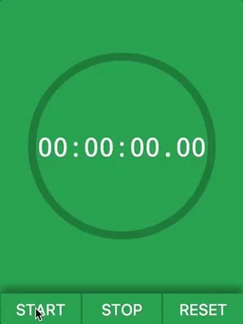

# Stopwatch with Voice Control

Live version: https://fac10.github.io/week2-stopwatch-joey-piotr/

A practical stopwatch to get the job done. Perfect for every timing situation including cooking, sports, games and work tasks. The app can also be operated with voice (only in Chrome).

Example commands:

#####Start

'start', 'begin', 'go', 'let's go'

#####Stop

'stop', 'pause', 'break'

#####Reset

'reset', 'end', 'finish'



<!-- ***************************************************** -->
##Stopwatch specification

 - I can press a start button, in order to start a timer
 - I can press a stop button, in order to stop the timer at how much time has passed since start
 - I can press a reset button, in order to stop the timer and reset the displayed time to 00:00:00:00
 - I can see the timer's current time in hours, seconds, minutes and milliseconds

 ###Stretch goals
 - Voice Control
 - Countdown functionality

<!-- ***************************************************** -->
## Getting started

```sh
git clone https://github.com/FAC10/week2-stopwatch-joey-piotr.git
cd REPO
npm install

#1. Start the development server with Browsersync reloading
npm run dev

#2. Open this url in your browser: http://localhost:3000

#3. You can run tests in separate terminal tab
npm test
```


<!-- ***************************************************** -->
## Testing - [Jest](https://facebook.github.io/jest/) (Piotr)


- "Zero configuration" testing platform
- Installed as an npm module
- No need to add testing library in html `<script>` tags
- Watch mode runs only test related to changed files
- [Test Javascript with Jest - 4min video on egghead.io](https://egghead.io/lessons/javascript-test-javascript-with-jest)

### How to set up Jest?

1. Install jest-cli npm module
```sh
npm install jest-cli --save-dev
```

2. Edit your `package.json`

```javascript
"scripts": {
  "test": "jest --coverage",
  "test:watch": "npm run test -- --watch"
}

// Optionally add:
"jest": {
   "collectCoverage": true,
   "notify": true
}
```


### How to use Jest? (Joey)

```javascript

// Function to be tested:
function pad(n) {
  return n < 10 ? `0${n}` : n;
}

pad(5); // '05'
pad(10); // 10

// Tests:
describe('pad', () => {
  test('returns 05 if n=5', () => {
    expect(pad(5)).toBe('05');
  });

  test('returns string with length 2 if n < 10', () => {
    expect(pad(6)).toHaveLength(2);
  });

  test('returns 10 if n=10', () => {
    expect(pad(10)).toBe(10);
  });
});
```


<!-- ***************************************************** -->
## Request Animation Frame (Joey)

- The window.requestAnimationFrame() method tells the browser that you want to perform an animation and requests that the browser call a specified function to update the animation.
- We call this method within our `runTimer()` function in order to update the value shown on the stopwatch. The number of callbacks is usually 60 times per second. `runTimer()` is called again within `window.requestAnimationFrame()` to keep updating the stopwatch value.

```javascript
// showTimer() is the function that displays the time on the stopwatch
// passedTime is the variable that tracks how much time has passed since the stopwatch was started

var animationRequestId;

function runTimer() {
  showTimer(passedTime);
  animationRequestId = window.requestAnimationFrame(runTimer);
}

function stopTimer() {
  window.cancelAnimationFrame(animationRequestId);
}
```
- We used this method because it means that the animation code is only called when the user's browser is ready to make changes to the screen, resulting in a smoother animation and a more efficient use of resources.
- We then used `Date.now()` to accurately keep track of time.
- [window.requestAnimationFrame() MDN documentation](https://developer.mozilla.org/en-US/docs/Web/API/window/requestAnimationFrame)
- [Animating with javascript from setInterval to requestAnimationFrame](https://hacks.mozilla.org/2011/08/animating-with-javascript-from-setinterval-to-requestanimationframe/)
- [Understanding JavaScript's requestAnimationFrame() method for smooth animations](http://www.javascriptkit.com/javatutors/requestanimationframe.shtml)


<!-- ***************************************************** -->
## Web Speech API (Piotr)

- The [Web Speech API](https://developer.mozilla.org/en-US/docs/Web/API/Web_Speech_API) enables you to incorporate voice data into web apps. The Web Speech API has two parts: SpeechSynthesis (Text-to-Speech), and SpeechRecognition (Asynchronous Speech Recognition).
- [Learn it with Wes Bos by taking JavaScript Challenge #20](https://javascript30.com/)


```javascript
// Check if you have access to SpeechRecognition API in your browser
if (!('webkitSpeechRecognition' in window)) {
  console.log('...Sorry, Web Speech API not supported by your browser :(');
} else {
  // Find SpeechRecognition function on the window object
  var SpeechRecognition = window.SpeechRecognition;

  // Instantiate object that will manage speech recognition
  var recognition = new SpeechRecognition();

  // Pick the settings that you like
  recognition.interimResults = true;  // Access results instantly
  recognition.lang = "en-US";
}


// Start listening
recognition.start();
// Keep listening :)
recognition.addEventListener('end', recognition.start);


// Handle results
recognition.addEventListener('result', e => {
  // Find the text in the event object
  var transcript = Array.from(e.results)
    .map(result => result[0])
    .map(result => result.transcript)
    .join('');

  // Have fun with the text :)
  haveFun(transcript);
});
```


<!-- ***************************************************** -->
## Tech stack
* Node
* Vanilla JavaScript
* ES6
* Flexbox
* Jest
* Browsersync
